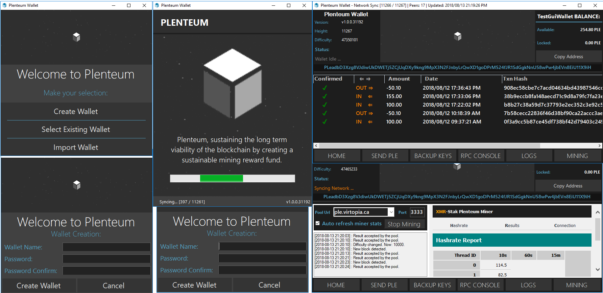

# Plenteum Wallet .NET

Plenteum Wallet written in C# for Windows OS (can run on Linux and Mac with Mono, but integrated Miner will not work on Linux or Mac).

# Simple CPU/GPU Mining from within your wallet

Click the Mining tab on the bottom right, and click "Start Mining" to get up and running. XMR-Stak will detect the optimal config for for CPU, AMD and/or Nvidia GPU's. Of course you can also fine tune the config files xmr-stak generates. Visit http://www.xmrstak.com for benchmarks!

# Download and Running

Check here for the latest release: 
https://github.com/plenteum/plenteum/releases

After downloading, extract everything from the zip and run `PlenteumWallet.exe`.

** Note, if you are running a local plenteumd instance, the wallet will connect to and use that, if no local node is available, the wallet will sync from a remote plenteum node. Either is fine. 

# In progress

The wallet is stable enough to run the release fine, however development is in progress and improvements are planned. You may download the release archive or compile yourself.

**Forked from https://github.com/turtlecoin/turtle-wallet-winforms - many thanks!